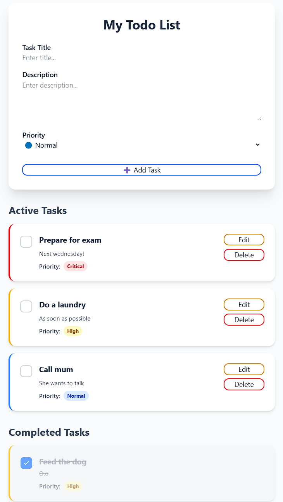

# Todo App

## Technologies Used

- **Next.js 15** - Frontend framework.
- **Tailwind CSS & DaisyUI** - CSS frameworks for styling and components.
- **ASP.NET Core (.NET 9)** - Backend Web API framework.
- **Entity Framework Core** - ORM for database interactions.
- **PostgreSQL** - Relational database.

---

## Setup & Run

### Prerequisites

- [Node.js (LTS)](https://nodejs.org/)
- [.NET 9 SDK](https://dotnet.microsoft.com/en-us/download/dotnet/9.0)
- [PostgreSQL](https://www.postgresql.org/download/)

### Installation & Running

1. Clone the repository:
   ```sh
   git clone https://github.com/konprok/todo_app.git
   cd todo_app
   ```

2. Frontend Setup:
   ```sh
   cd frontend
   npm install
   npm run dev
   ```
   - Frontend running at: [http://localhost:3000](http://localhost:3000)

3. Backend Setup:
   - Navigate to backend folder:
   ```sh
   cd backend/TodoList.WebApi
   dotnet restore
   dotnet run
   ```
   - Backend running at: [http://localhost:5020](http://localhost:5020)

4. Configure your database connection string in `appsettings.json`:
   ```json
   "ConnectionStrings": {
     "DefaultConnection": "Host=localhost;Port=5432;Database=your_db;Username=your_user;Password=your_password"
   }
   ```

---

# API Documentation

## TodoController

### POST `/todos`

**Description:** Create a new Todo task.

#### Body (JSON):
```json
{
  "title": "string",
  "description": "string (optional)",
  "priority": 1 // 1=Low, 2=Normal, 3=High, 4=Critical
}
```

#### Responses:
- ✅ `200 OK` - Todo successfully created.
- ❌ `400 Bad Request` - Invalid input data.
- ❌ `500 Internal Server Error` - Internal server error.

---

### GET `/todos`

**Description:** Retrieve all Todo tasks.

#### Responses:
- ✅ `200 OK` - Successfully retrieved todo list.
- ❌ `500 Internal Server Error` - Internal server error.

---

### GET `/todos/{id}`

**Description:** Retrieve specific Todo task by ID.

#### Parameters:
- `id` (long) - Todo ID.

#### Responses:
- ✅ `200 OK` - Successfully retrieved todo.
- ❌ `404 Not Found` - Todo not found.
- ❌ `500 Internal Server Error` - Internal server error.

---

### PATCH `/todos/{id}`

**Description:** Update existing Todo task.

#### Parameters:
- `id` (long) - Todo ID.

#### Body (JSON):
```json
{
  "title": "string",
  "description": "string (optional)",
  "priority": 2
}
```

#### Responses:
- ✅ `200 OK` - Todo successfully updated.
- ❌ `400 Bad Request` - Invalid input data.
- ❌ `404 Not Found` - Todo not found.
- ❌ `500 Internal Server Error` - Internal server error.

---

### PATCH `/todos/{id}/status`

**Description:** Change completion status of a Todo task.

#### Parameters:
- `id` (long) - Todo ID.

#### Body (JSON):
```json
true // or false
```

#### Responses:
- ✅ `200 OK` - Status successfully updated.
- ❌ `404 Not Found` - Todo not found.
- ❌ `500 Internal Server Error` - Internal server error.

---

### DELETE `/todos/{id}`

**Description:** Delete a Todo task by ID.

#### Parameters:
- `id` (long) - Todo ID.

#### Responses:
- ✅ `200 OK` - Todo successfully deleted.
- ❌ `404 Not Found` - Todo not found.
- ❌ `500 Internal Server Error` - Internal server error.

---

## Application Preview

Below is a screenshot demonstrating the application's user interface:

<div align="center">
    
</div>

---
